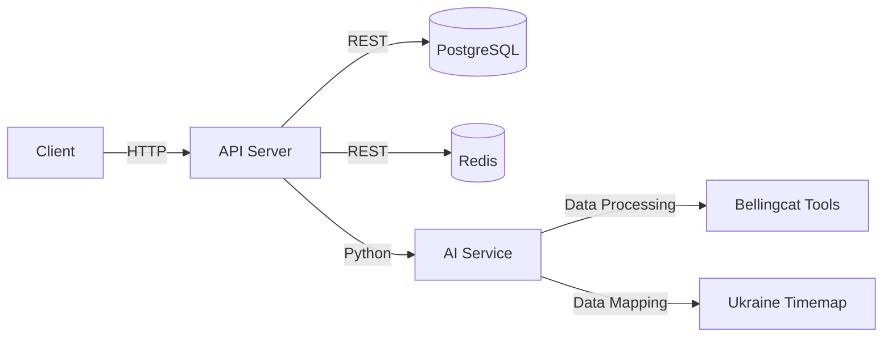

# Military Activity Reporting and Prediction App

A comprehensive tool for real-time military activity reporting and future scenario predictions.

This cross-platform application provides users with categorized reports on military activities and predictive insights using AI. It features interactive maps and graphs to visualize military initiatives, helping users make informed decisions based on open-source data.

## Features

- **Real-Time Reports**: Access to categorized reports on ongoing military activities.
- **Interactive Maps**: Visualize the strength and direction of military initiatives.
- **Predictive Scenarios**: Generate AI-driven predictions for future military scenarios.
- **Cross-Platform**: Available on both web and mobile platforms.
- **User-Friendly Interface**: Designed for ease of use by journalists and analysts.

## Tech Stack

- **Frontend**
  - Web: React 18.2.0
  - Mobile: React Native 0.71.0
  - State Management: Redux 4.2.0
  - Styling: Styled-components 5.3.3
  - Maps: Leaflet 1.9.4

- **Backend**
  - Server: Node.js 18.17.0
  - Framework: Express.js 4.18.2
  - AI Integration: Python 3.10 with FastAPI 0.85.0
  - Data Processing: Pandas 1.5.3, Ollama AI

- **Database**
  - Primary: PostgreSQL 14
  - Caching: Redis 7.0

- **Infrastructure**
  - Frontend Hosting: Vercel
  - Backend Hosting: AWS Elastic Beanstalk
  - Database Hosting: AWS RDS for PostgreSQL
  - CI/CD: GitHub Actions

## Architecture

This app follows a microservices architecture, integrating a React-based frontend with a Node.js and Python-based backend. The backend interfaces with PostgreSQL for data storage and uses Redis for caching. 



## Project Structure

```plaintext
/military-activity-app
|-- /frontend
|   |-- /src
|   |   |-- /components
|   |   |-- /pages
|   |   |-- /redux
|   |   |-- /styles
|   |   |-- App.js
|   |   |-- index.js
|-- /mobile
|   |-- /src
|   |   |-- /components
|   |   |-- /screens
|   |   |-- /redux
|   |   |-- /styles
|   |   |-- App.js
|-- /backend
|   |-- /src
|   |   |-- /controllers
|   |   |-- /models
|   |   |-- /routes
|   |   |-- /services
|   |   |-- app.js
|-- /ai-service
|   |-- /src
|   |   |-- /models
|   |   |-- /routes
|   |   |-- main.py
|-- /scripts
|-- package.json
|-- README.md
```

## Getting Started

### Prerequisites

- Node.js 18.x
- Python 3.10
- PostgreSQL 14
- Redis 7.0

### Installation

1. Clone the repository:
   ```bash
   git clone https://github.com/yourusername/military-activity-app.git
   cd military-activity-app
   ```

2. Install dependencies for each component:
   ```bash
   cd frontend && npm install
   cd ../mobile && npm install
   cd ../backend && npm install
   cd ../ai-service && pip install -r requirements.txt
   ```

### Environment Variables

Create a `.env` file based on `.env.example` to configure your environment variables.

### Running

1. Start the backend server:
   ```bash
   cd backend
   npm start
   ```

2. Start the AI service:
   ```bash
   cd ai-service
   uvicorn main:app --reload
   ```

3. Start the frontend:
   ```bash
   cd frontend
   npm start
   ```

4. Start the mobile app:
   ```bash
   cd mobile
   npm start
   ```

## Documentation

For more detailed information, refer to the following documents:

- [Product Requirements](docs/PRD.md)
- [Design Brief](docs/DESIGN.md)
- [Architecture](docs/ARCHITECTURE.md)

## License

This project is licensed under the MIT License.